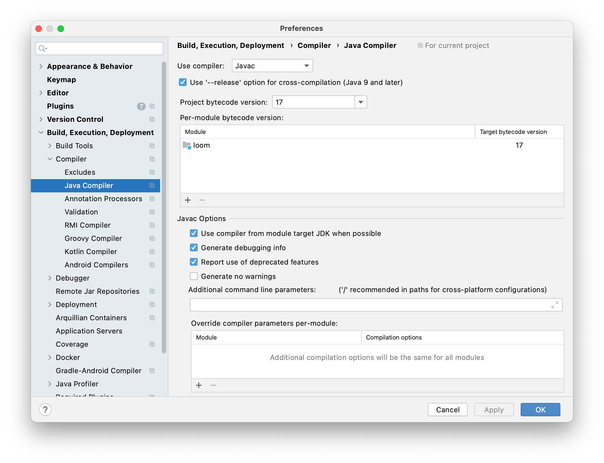

# loom-vs-coroutines

Comparison between Project Loom and Kotlin Coroutines

## Goals

Have a look on

- Parellism
- Structured Concurrency
- ThreadLocal like Context
- Integrate with existing framework (webframework/io)
- Cancellation of process trees
- Andere implementaties (Fibers)
- Reactive Streams (Flow, Channel)

## Notes on running the project in Intellij

- open loom or coroutines separately (not in one project)
- use java 1.8 for Kotlin/coroutines
- Set up loom as follows:
  

## See also

- https://wiki.openjdk.java.net/display/loom/Structured+Concurrency
- https://cr.openjdk.java.net/~rpressler/loom/loom/sol1_part2.html
- https://www.javaadvent.com/2020/12/project-loom-and-structured-concurrency.html
